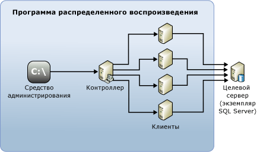

# Распределенное воспроизведение SQL Server

[!INCLUDE[appliesto-ss-xxxx-xxxx-xxx-md](../../includes/appliesto-ss-xxxx-xxxx-xxx-md.md)]

Функция распределенного воспроизведения [!INCLUDE[msCoName](../../includes/msconame-md.md)] [!INCLUDE[ssNoVersion](../../includes/ssnoversion-md.md)] позволяет оценить влияние будущих обновлений [!INCLUDE[ssNoVersion](../../includes/ssnoversion-md.md)]. Ее также можно использовать для оценки влияния обновления аппаратной части и операционной системы, а также для настройки [!INCLUDE[ssNoVersion](../../includes/ssnoversion-md.md)] .

## Преимущества распределенного воспроизведения

Как и SQL Server Profiler, распределенное воспроизведение можно использовать для воспроизведения записанной трассировки в обновленной тестовой среде. В отличие от SQL Server Profiler, распределенное воспроизведение не ограничено воспроизведением рабочих нагрузок с одного компьютера.

Распределенное воспроизведение является более масштабируемым решением, чем SQL Server Profiler. Распределенное воспроизведение используется для воспроизведения рабочих нагрузок со многих компьютеров и лучше моделирует важные реальные рабочие нагрузки.

Функция распределенного воспроизведения [!INCLUDE[msCoName](../../includes/msconame-md.md)] [!INCLUDE[ssNoVersion](../../includes/ssnoversion-md.md)] позволяет использовать несколько компьютеров для воспроизведения данных трассировки и моделирования критически важной рабочей нагрузки. Программу распределенного воспроизведения можно использовать для тестирования совместимости приложений, производительности и планирования загрузки.

## Применение распределенного воспроизведения

Функции SQL Server Profiler и распределенного воспроизведения частично совпадают.

С помощью SQL Server Profiler можно воспроизводить записанную трассировку в обновленной тестовой среде. Кроме того, результаты воспроизведения можно анализировать с целью поиска потенциальных функциональных несовместимостей и проблем производительности. Однако SQL Server Profiler позволяет воспроизводить рабочую нагрузку только с одного компьютера. При воспроизведении работы загруженного приложения OLTP с большим числом активных одновременных подключений или пропускной способностью на сеть для SQL Server Profiler может не хватить ресурсов.

Распределенное воспроизведение является более масштабируемым решением, чем SQL Server Profiler. Распределенное воспроизведение используется для воспроизведения рабочих нагрузок с нескольких компьютеров и лучше моделирует важные реальные рабочие нагрузки.

В следующей таблице описывается, когда нужно использовать каждое средство.

|Инструмент|Применение|
|----------|---------------|
| Приложение SQL Server Profiler | Нужно использовать обычный механизм воспроизведения на одном компьютере. В частности, если необходимы возможности построчной отладки, такие как команды **По шагам**, **Выполнить до текущей позиции**и **Точка останова** .   Необходимо воспроизвести трассировку служб [!INCLUDE[ssASnoversion](../../includes/ssasnoversion-md.md)] . |
| Распределенное воспроизведение |Необходимо оценить совместимость приложений. Например, нужно протестировать варианты обновления [!INCLUDE[ssNoVersion](../../includes/ssnoversion-md.md)] и операционной системы, модернизацию оборудования или настройку индекса.   Уровень параллелизма в записанной трассировке настолько высок, что один клиент воспроизведения не сможет ее смоделировать.|  

## Основные понятия распределенного воспроизведения

Среда распределенного воспроизведения включает следующие компоненты.  

- **Средство администрирования распределенного воспроизведения**. Консольное приложение **DReplay.exe**, которое используется для взаимодействия с контроллером распределенного воспроизведения. Используйте средство администрирования для управления распределенным воспроизведением.  

- **Контроллер распределенного воспроизведения**. Компьютер, на котором выполняется служба Windows "Контроллер распределенного воспроизведения [!INCLUDE[ssNoVersion](../../includes/ssnoversion-md.md)]". Контроллер распределенного воспроизведения управляет согласованными действиями клиентов распределенного воспроизведения. В каждой среде распределенного воспроизведения можно установить только один экземпляр контроллера.  

- **Клиенты распределенного воспроизведения.** Один или несколько компьютеров (физических или виртуальных), на которых запущена служба Windows "Клиент распределенного воспроизведения [!INCLUDE[ssNoVersion](../../includes/ssnoversion-md.md)]". Клиенты распределенного воспроизведения работают совместно для имитации рабочей нагрузки на экземпляре [!INCLUDE[ssNoVersion](../../includes/ssnoversion-md.md)]. В каждой среде распределенного воспроизведения можно установить один или несколько клиентов.  

- **Целевой сервер.** Экземпляр [!INCLUDE[ssNoVersion](../../includes/ssnoversion-md.md)], который клиенты распределенного воспроизведения могут использовать для воспроизведения данных трассировки. Рекомендуется размещать целевой сервер в среде тестирования.

Средство администрирования, контроллер и клиент распределенного воспроизведения могут быть установлены на одном компьютере или на разных компьютерах. На одном компьютере может выполняться только один экземпляр контроллера распределенного воспроизведения или службы клиента.

На следующем рисунке показана физическая архитектура распределенного воспроизведения в [!INCLUDE[ssNoVersion](../../includes/ssnoversion-md.md)] .  

  

## Задачи распределенного воспроизведения

|Описание задачи|Раздел|  
|----------------------|-----------|  
| Настройка распределенного воспроизведения. | [Настройка распределенного воспроизведения](../../tools/distributed-replay/configure-distributed-replay.md) |
| Описывает подготовку входных данных трассировки. | [Подготовка входных данных трассировки](../../tools/distributed-replay/prepare-the-input-trace-data.md) |
| Описывает процесс воспроизведения данных трассировки. |[Воспроизведение данные трассировки](../../tools/distributed-replay/replay-trace-data.md) | | Описывает просмотр результатов данных трассировки распределенного воспроизведения. |[Просмотр результатов воспроизведения](../../tools/distributed-replay/review-the-replay-results.md)|
| Описывает, как при помощи средства администрирования можно инициировать операции на контроллере, наблюдать за ними и отменять их. | [Параметры командной строки средства администрирования (программа распределенного воспроизведения)](../../tools/distributed-replay/administration-tool-command-line-options-distributed-replay-utility.md) |

## См. также:

[Форум о распределенном воспроизведении SQL Server](https://social.technet.microsoft.com/Forums/sl/sqldru/)