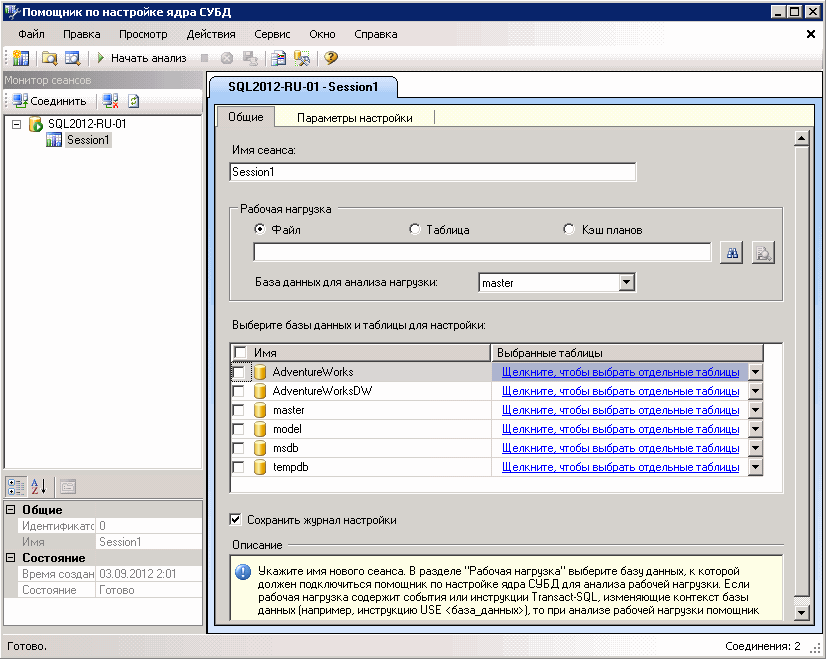

# Урок 1-1-Запуск помощника по настройке ядра СУБД
[!INCLUDE[appliesto-ss-xxxx-xxxx-xxx-md](../../includes/appliesto-ss-xxxx-xxxx-xxx-md.md)]Чтобы начать, откройте помощник по настройке ядра СУБД графический пользовательский интерфейс (GUI). При первом использовании помощника по настройке ядра СУБД для инициализации этого приложения его должен запустить член, имеющий предопределенную роль сервера **sysadmin** . После инициализации помощника по настройке ядра СУБД его могут использовать члены предопределенной роли базы данных **db_owner** для настройки тех баз данных, которыми они владеют. Дополнительные сведения об инициализации помощника по настройке ядра СУБД см. в разделе [Запуск и использование помощника по настройке ядра СУБД](../../relational-databases/performance/start-and-use-the-database-engine-tuning-advisor.md).  
  
### Откройте графический пользовательский интерфейс помощника по настройке ядра СУБД.  
  
1.  В меню ОС Windows **Пуск** последовательно наведите указатель на пункты **Все программы**, [!INCLUDE[ssCurrentUI](../../includes/sscurrentui-md.md)], **Средства обеспечения производительности**и выберите пункт **Помощник по настройке ядра СУБД**.  
  
2.  В диалоговом окне **Соединение с сервером** подтвердите заданные по умолчанию параметры, а затем нажмите кнопку **Подключиться**.  
  
По умолчанию помощник по настройке ядра СУБД открывается в конфигурации, показанной на следующем рисунке.  
  
  
  
> [!NOTE]  
> На вкладке и в поле **Имя сеанса** отображается имя компьютера и экземпляра, к которому подключен пользователь. А также текущие дата и время.  
  
При первом запуске помощника в его графическом интерфейсе пользователя отображаются две основные панели.  
  
-   Левая панель содержит монитор сеансов, в котором выводится список всех сеансов настройки, выполненных с этим экземпляром [!INCLUDE[msCoName](../../includes/msconame-md.md)] [!INCLUDE[ssNoVersion](../../includes/ssnoversion-md.md)] . При открытии помощника по настройке ядра СУБД вверху панели отображается новый сеанс. Имя этого сеанса можно задать на соседней панели. Первоначально показан только сеанс по умолчанию. Этот сеанс по умолчанию создается помощником по настройке ядра СУБД автоматически. После проведения настройки баз данных все сеансы настройки для экземпляра [!INCLUDE[ssNoVersion](../../includes/ssnoversion-md.md)] , с которым установлено соединение, показаны под новым сеансом. Чтобы переименовать, закрыть, удалить или скопировать сеанс настройки, следует щелкнуть его правой кнопкой мыши. Если щелкнуть правой кнопкой мыши список, можно отсортировать сеансы по имени, состоянию, времени создания или создать новый сеанс. В нижней части панели приводятся сведения о выбранном сеансе настройки. Нажав кнопку **По категориям** , можно выбрать режим отображения, при котором сведения организованы в категории. Если нажать кнопку **По алфавиту** , сведения будут отсортированы в алфавитном порядке. Кроме того, монитор сеансов можно скрыть, перетащив правую границу его панели к левой границе окна. Чтобы снова вывести монитор сеансов на экран, перетащите границу панели вправо. Монитор сеансов позволяет просматривать предыдущие сеансы настройки или использовать их для создания новых сеансов, имеющих сходные определения. Кроме того, с помощью монитора сеансов можно разрабатывать рекомендации по настройке. Дополнительные сведения см. в статье [Просмотр и работа с выходными данными помощника по настройке ядра СУБД](../../relational-databases/performance/view-and-work-with-the-output-from-the-database-engine-tuning-advisor.md). Для возврата в этот учебник нажмите кнопку **Назад** в окне браузера.  
  
-   Правая панель содержит вкладки **Общие** и **Параметры настройки** . Здесь можно определить сеанс настройки ядра СУБД. На вкладке **Общие** введите имя сеанса, определите используемый файл рабочей нагрузки или таблицу и выберите базу данных и таблицы, которые требуется настроить в данном сеансе. Рабочая нагрузка представляет собой набор инструкций [!INCLUDE[tsql](../../includes/tsql-md.md)] , выполняемый в одной или нескольких базах данных, которые необходимо настроить. В помощнике по настройке ядра СУБД в качестве входной рабочей нагрузки при настройке базы данных используются файлы и таблицы трассировки, скрипты [!INCLUDE[tsql](../../includes/tsql-md.md)] и XML-файлы. На вкладке **Параметры настройки** можно выбрать структуры физической структуры базы данных (индексы или индексированные представления) и стратегию разделения на секции, которую должен проанализировать помощник по настройке ядра СУБД. На этой вкладке также указывается максимальное время, которое помощник по настройке ядра СУБД может затратить на настройку рабочей нагрузки. По умолчанию помощник по настройке ядра СУБД будет настраивать рабочую нагрузку в течение 1 часа.  
  
> [!NOTE]  
> Помощник по настройке ядра СУБД может принимать на входе XML-файлы, если скрипт [!INCLUDE[tsql](../../includes/tsql-md.md)] импортируется из редактора запросов среды [!INCLUDE[msCoName](../../includes/msconame-md.md)][!INCLUDE[ssManStudioFull](../../includes/ssmanstudiofull-md.md)] . Дополнительные сведения см. в разделе [!INCLUDE[ssManStudioFull](../../includes/ssmanstudiofull-md.md)] Запуск и использование помощника по настройке ядра СУБД [, в котором рассматривается запуск помощника по настройке ядра СУБД из редактора запросов среды](../../relational-databases/performance/start-and-use-the-database-engine-tuning-advisor.md).  
  
## Следующая задача занятия  
[Настройка параметров и вида средств](../../tools/dta/lesson-1-2-setting-tool-options-and-layout.md)  
  
  
  
