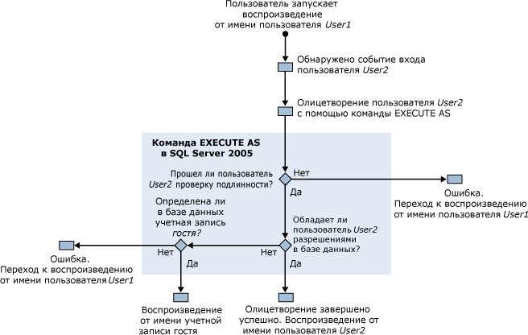

# Разрешения, необходимые для запуска приложения SQL Server Profiler
[!INCLUDE[appliesto-ss-xxxx-xxxx-xxx-md](../../includes/appliesto-ss-xxxx-xxxx-xxx-md.md)]
  По умолчанию для запуска приложения [!INCLUDE[ssSqlProfiler](../../includes/sssqlprofiler-md.md)] требуются такие же разрешения, что и для хранимых процедур языка Transact-SQL, используемых для создания трассировок. Для запуска приложения [!INCLUDE[ssSqlProfiler](../../includes/sssqlprofiler-md.md)] пользователь должен обладать разрешением ALTER TRACE. Дополнительные сведения см. в разделе [GRANT, предоставление разрешений на сервер (Transact-SQL)](../../t-sql/statements/grant-server-permissions-transact-sql.md).  
  
> [!IMPORTANT]  
>  Пользователи, которые имеют разрешение SHOWPLAN, ALTER TRACE или VIEW SERVER STATE, могут просматривать запросы, захваченные выходом Showplan. Эти запросы могут содержать конфиденциальные сведения, такие как пароли. В связи с этим рекомендуется предоставлять данные разрешения только пользователям, которые имеют право просмотра конфиденциальных данных, например членам предопределенной роли базы данных db_owner или членам предопределенной роли сервера sysadmin. Также рекомендуется сохранять файлы Showplan или файлы трассировки, содержащие события, связанные с инструкцией Showplan, только в каталог, расположенный в файловой системе NTFS, для которого есть возможность ограничить доступ, предоставляя его только пользователям, имеющим право просмотра конфиденциальных данных.  
  
## Разрешения на воспроизведение трассировок  
 Для воспроизведения трассировок пользователю требуется разрешение ALTER TRACE.  
  
 Однако если во время воспроизведения трассировки возникло событие «Audit Login», приложение [!INCLUDE[ssSqlProfiler](../../includes/sssqlprofiler-md.md)] использует команду EXECUTE AS. [!INCLUDE[ssSqlProfiler](../../includes/sssqlprofiler-md.md)] использует для олицетворения пользователя, связанного с событием входа в систему.  
  
 Если в воспроизводимой трассировке приложение [!INCLUDE[ssSqlProfiler](../../includes/sssqlprofiler-md.md)] обнаруживает событие входа в систему, то производятся проверки следующих разрешений.  
  
1.  Пользователь1, имеющий разрешение ALTER TRACE, запускает воспроизведение трассировки.  
  
2.  В воспроизводимой трассировке возникло событие входа в систему для Пользователя2.  
  
3.  [!INCLUDE[ssSqlProfiler](../../includes/sssqlprofiler-md.md)] олицетворяет Пользователя2 командой EXECUTE AS.  
  
4.  [!INCLUDE[ssNoVersion](../../includes/ssnoversion-md.md)] пытается проверить подлинность Пользователя2, и, в зависимости от результатов, происходят следующие действия.  
  
    1.  Если проверить подлинность Пользователя2 невозможно, приложение [!INCLUDE[ssSqlProfiler](../../includes/sssqlprofiler-md.md)] возвращает ошибку и продолжает воспроизведение трассировки от имени Пользователя1.  
  
    2.  Если проверка подлинности Пользователя2 прошла успешно, воспроизведение трассировки продолжается от имени Пользователя2.  
  
5.  Разрешения для Пользователя2 проверяются в базе данных назначения, и, в зависимости от результата, происходят следующие действия.  
  
    1.  Если у Пользователя2 есть разрешения на целевую базу данных, то олицетворение проходит успешно и трассировка воспроизводится от имени Пользователя2.  
  
    2.  Если у Пользователя2 нет разрешений на целевую базу данных, сервер проверяет существование пользователя Guest в этой базе данных.  
  
6.  В целевой базе данных проверяется существование пользователя Guest, и, в зависимости от результата, происходят следующие действия.  
  
    1.  Если учетная запись «Guest» существует, трассировка воспроизводится от ее имени.  
  
    2.  Если в базе данных назначения отсутствует учетная запись «Guest», возвращается ошибка и трассировка воспроизводится от имени Пользователя1.  
  
 На следующей диаграмме показан процесс проверки разрешений во время воспроизведения трассировок:  
  
   
  
## См. также:  
 [Хранимые процедуры приложения SQL Server Profiler (Transact-SQL)](../../relational-databases/system-stored-procedures/sql-server-profiler-stored-procedures-transact-sql.md)   
 [Воспроизведение трассировок](../../tools/sql-server-profiler/replay-traces.md)   
 [Создание трассировки (приложение SQL Server Profiler)](../../tools/sql-server-profiler/create-a-trace-sql-server-profiler.md)   
 [Воспроизведение таблицы трассировки (приложение SQL Server Profiler)](../../tools/sql-server-profiler/replay-a-trace-table-sql-server-profiler.md)   
 [Воспроизведение файла трассировки (приложение SQL Server Profiler)](../../tools/sql-server-profiler/replay-a-trace-file-sql-server-profiler.md)  
  
  
